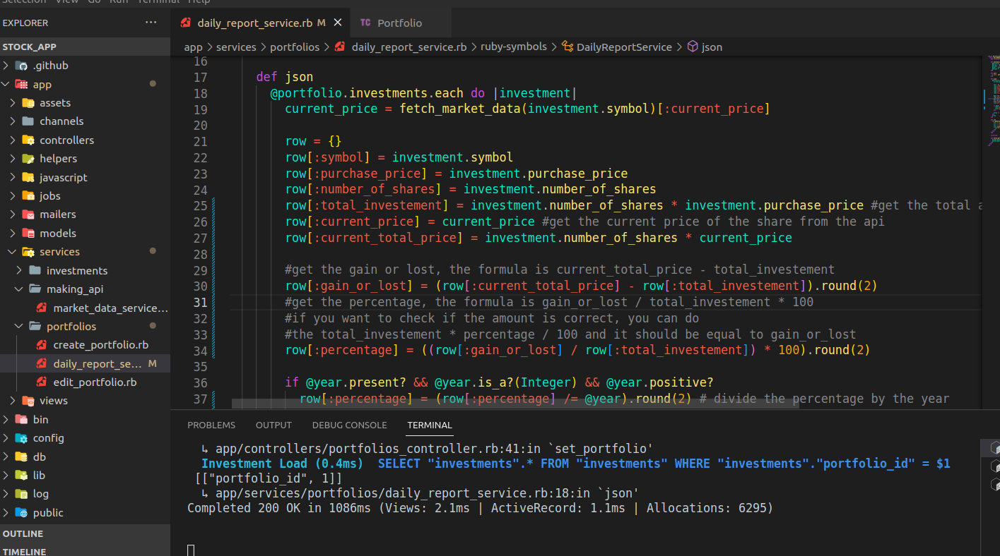

# STOCK APP

> This app is a simple investment portfolio management system that allows users to track their investments and view performance metrics. first of all the user should create an account, loggin in trougth the token and create a portfolio. the app has services to calculate the profit and lost, it has filter such as year and it can download the csv file. This API is made these models:

  - User Model
  - Portfolio
  - Investment
  
### ERD PG

### Message rendered from the backend 

### User confirmation Mailer

### Deployment
 [Video](https://www.loom.com/share/25504df4e78a44d8b1a2d5caa4b71c98?sid=89cf883f-b4f1-4a6b-aa26-17878595dd0c)
## Built With

- Rails
- Ruby 
- Postgresql
- Devise
- JWT
- Alpha Vantage
- ActiveRecord Serializer
- Sidekiq
- Redis
- Rspec

## Endepoints
  allow user to authenticate and return a token

`POST /api/users/login`

allows user to create an account

`POST /users/`

create a portfolio

`POST /api/portfolios/`

get a portfolio with investements

`GET /api/portfolios/:id`

crreate an investement

`POST /api/portfolios/:id/investments`

## Notice
 all the calculations are in the daily_report_service.
  

## Getting Started

Here are the steps to follow in order to get this project on your local computer.

### Prerequisites

`rails v7.0.2 +`

`ruby v3.1.2 +`

### Setup

clone this repo by typing `git clone https://github.com/vic778/stock_app`

### Install

install the dependencies by typing `bundle install`

### Usage

start the local server by running `rails s`

### Testing

run the tests by typing `rspec`

### Documentation

## Author

👤 **Victor Barh**

- GitHub: [@Vvic778](https://github.com/vic778)
- Twitter: [@victoirBarh](https://twitter.com/)
- LinkedIn: [LinkedIn](https://linkedin.com/in/victoir-barh)

## 🤝 Contributing

Contributions, issues and feature requests are welcome!

Feel free to check the [issues page](issues/).

## Show your support

Give a ⭐️ if you like this project!

## Acknowledgments

 N/A

## 📝 License

This project is [MIT](lic.url) licensed.
